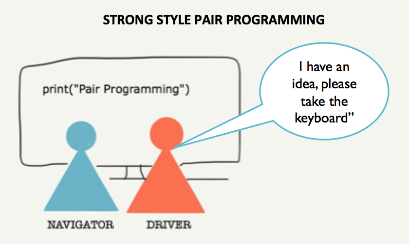
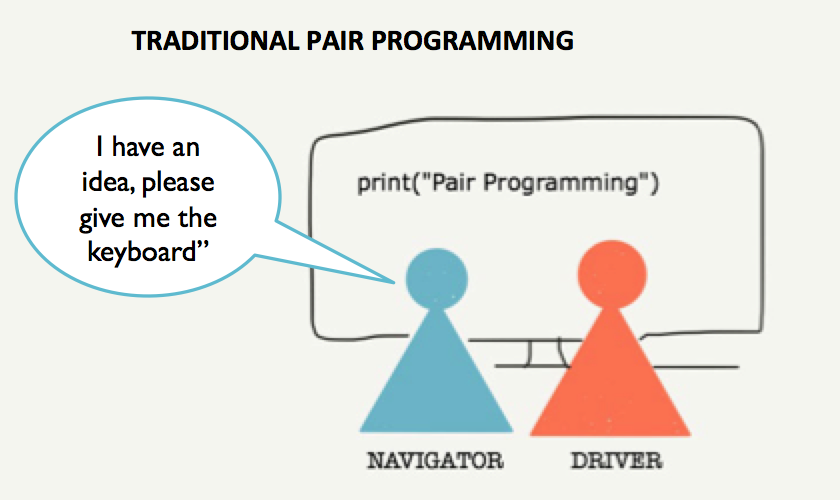

# What is Strong-Style Pair Programming

For Pair Programming, you have two people, one task and a shared computer the pair works on. In the pair you are either contributing or learning, or both. When you are contributing, you get the best out of both of you into the work you are doing. And when you are learning, you are a little bit better next time you do things, with or without the pair. It's not about taking turns using the computer or being someone else's typist, but engaging two minds on the same problem so that a solution can be developed more quickly and with higher quality than if one person was working on it alone. Why would we not want that?

The experience for many people is that the discomfort of pairing outweighs the benefits. And when we try it and don't feel we contributed or learned, we don't want to try again.

I actively avoided pairing up to a point where I learned that there are options for setting up the pairing relationship. What I had been doing was traditional pairing, where the person with the idea would take the keyboard. I found myself often being either the less experienced programmer or the more uncomfortable half of the pair, and watching someone do things I could barely follow. I watched a similar dynamic on courses I taught where I had people pair without giving them specific style or rules.

When I learned there was another way of playing with the pairing dynamics, used in mob programming as a core practice, called **Strong-Style Pairing**, I found the contributing and learning I was always looking for.

## Strong-Style Pair Programming Defined

In Strong-Style Pair Programming, every single idea must actively flow through two people - the pair. For that to happen, the one with the idea taking the work forward must let go of the keyboard, and hand it away to the pair and use their words in expressing what their intent and details to match that intent are. Strong-Style Pair Programming takes the programmers hands off the keyboard and enforces a rule of vocalising your thoughts.

For an idea to get to the keyboard, you need the pairs hands to do the typing for you. If you have an idea, you ask your pair to take the keyboard.

Contrast this with traditional pair programming, where the one with the idea takes the keyboard. The dynamic is significantly different. Even if the driver speaks out loud of their thoughts as they are doing the work, in traditional style the navigator is in a review role continuously translating both thoughts and actions of their pair.

When the driver is service to the navigator by dealing with the details of what goes on on the computer and the navigator is in service to the driver by directing at the highest level of abstraction, the driver can pick up work as navigator feeds it, and pairing can be effective.

The term Strong-Style was coined by Arlo Belshee to distinguish this style of pair programming observed in the wild in conference sessions.
