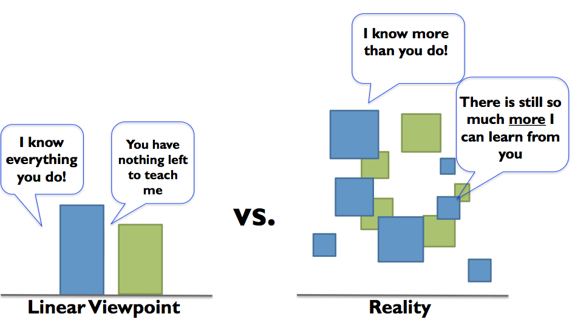

# Collaborate Beyond Pairing

Pairing is something where two people work on the same thing, at the same time, in the same space (or through sharing a virtual space).

In general, the idea of pairing making sense is that both of the people in the pair have things to contribute. It is not just a learning from the master -setting, but even the masters can learn from the new people.

When we forget that everyone has things to contribute, or when we optimize time we see other forms of collaboration.

## Side by Side Pairing - the Expert Flavor

Imagine walking into a room, seeing two people sit next to each other. Both with their hands on their own computers, the only thing reminding pairing here is the proximity.

There are people who consider this a form of pairing - side by side pairing. The idea here is that often one of the two finds themselves in a teacher role, and makes themselves available for questions to the other person. But they don't really share the task in the sense of pairing.

## Side by Side Pairing - the Two Drivers Flavor

With programming, the pace of input is hardly a limiting factor. For testing and covering a set of variables to compare, the pace of input can be a limiting factor.

Sometimes you see a form of side by side pairing that is about actually engaging on the same activity, but needing two sets of controls, both assuming a vocal Driver role sharing the task through coordination of what happens on each end. The two might be intertwined in the activity so that one looks one end, the other another end. And it is very much collaborative.

It's more about sharing energy, and enthusiasm, giving hints of things others can pick up and run with, and continuously coming back together to understand where we are.

This form of side by side pairing lends itself to sharing work over a less rich medium, such as a chat. Calling out progress and observations, pondering on things together can be very collaborative. But having a pair of people on it, does not really make it pairing.

In the past, some of my most fun days have been when we work side by side with other people, testers and developers, growing ideas and solving problems. While pairing is great and gives a structure, the other ways of working together also beat the "alone in a corner" any day.

## Two People Who Get Me To Do Stuff

Sometimes, I feel like I'm a master of procrastination. For some types of tasks (usually ones requiring me to do something small by myself that has little dependency or relevance to other people) just seem much bigger than they realistically should. I wanted to make note of two people I respect and look up to for making me do things I don't seem to get done.

### 'I'll just sit here until it's done'

There's a team next door here, that works on the same system but we could easily organize our work so that we don't share that much. I had decided however I wanted to try out running their test automation, maybe even extending that when things I want to test benefit from what they've built. And I got the usual mention: there's instructions, just three steps. So I went and followed the instructions, only to be there in (typically) unlucky day when they had changed everything except their instructions while upgrading their test runner.

So a day later, I hear they've improved the instructions and we're back to just three steps. As I work on something else, I don't really find the energy to go back and see how things are. I gave it change, it did not work out, not like I really need it anyway. So my favorite colleague from that team comes into my team room, with their laptop and sits on the corner of my desk saying: 'Try it. I'll just sit here until it's done'. And I try it, and five minutes later we have delightful discussions on my feedback on making sense of this as someone new.

Thinking back to this, I realize this is a tool they use all the time. Actively deciding something needs to be done and committing his time to insert positive pressure by just being there. Setting an expectation, and making themselves available.

### 'Let's pair'

Another person takes it further. They volunteers to pair and actively schedules their time to get more out of the shared work. Sometimes their 'Let's pair' attitude feels like pushy, but the results tend to be great. It takes time to get used to the idea that someone is there with you on you doing something you know you sort of could do by yourself.

As one of the organizers for European Testing Conference, they have paired with every one of us. The pairing has both supported timely doing of things, but also created contents we wouldn't create without pairing. On the other hand, it also created schism when the style of pairing was a bad fit.

There was a task that I needed to do, and I was trying to find time in my busy schedules to do it. With him proclaiming 'Let's pair on it', it got done. And while I was sure I had the best skills for the task, I was again reminded on the power of another person on identifying things I could be missing.

### From Envy to Stretching

I find it extremely hard and energy consuming to force myself on people who are not actively and clearly inviting my participation. So I envy people who, with a positive attitude just go and do it, like these two people. Recognizing the envy gives me a personal stretch goal. Try it, do more of it, find your own style.

It's not about doing what they do, but knowing if doing what they do would help you in situations you experience.
