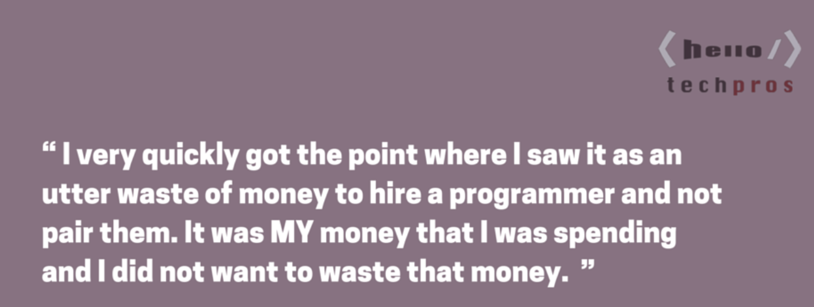

Giving the style a name helped it move from a rude style of an overconfident jerk being a backseat driving to redefining roles in pair differently to increase engagement, in particularly when skill difference in a pair was evident. It still feels rude when done without the pair's consent and has resulted in several ends of pairing relationships.

Back in the days when testing dojos were new, I tried some of them. We would pair up in front of a computer to test, rotate on clock so that everyone around the round table got their share of the computer.

I never particularly liked it. I found that people were really bad at explaining what they were doing and that is the key thing I'd want to learn from - ideas that drive them. The roles of driver and navigator split so that the driver tests and talks out loud, the navigator observes, makes notes and adds stuff felt it was not very engaging. Everyone in the room would have a different idea of what was going on at the computer, deciphering most information from actions as people tend to be bad at talking while testing without significant practice.

As I was teaching testing, I adopted free-form pairing into my courses. I'd have people work in pairs, without assigning them roles and see what comes out. Most often I saw one of the people in the pair be active and the other one trying to contribute something, often quietly watching unless there was a specific discussion on what to do.

Then I learned about strong-style pair programming. With strong-style pair programming, the core is that any ideas from one person's head must go through the other person's hands. It relies on the roles of driver and navigator, but changes what each of them is expected to do. Driver is the one who listens and types. Navigator is the one who tells what to do.

In classroom settings, particularly when working in mob (group) format, this style works wonders. You can place the navigator as far as possible from the driver at the keyboard, and everyone can hear what the driver hears. And it guides you to vocalize the core of what we're doing, leaving everyone same experience of navigation as the driver gets.

## Driver-Navigator Pairing in Strong-Style

For the pair to work well, both parties in the pair need to work well in their roles, and there's specific skills and techniques you can learn to work better from get-go with a new pair in either one of the roles. Techniques, however, are just ideas until you apply them in practice. Only through doing you can learn to pick up the small hints on what would be right thing to do, as you both are equally responsible for your mutual success.

We may think of the driver as an intelligent input device. Intelligence means that while the driver takes orders on what to do and where to go, the driver can also guide to get on the right abstraction level or improvise within the box the navigator gives her.

The navigator is responsible for mining the to-do list and passing the next things to do with instructions on the highest possible abstraction level.

This all builds on trust. The navigator may be just one step ahead of you, and thus unable to give you a clear overview of what you're about to do. The direction the navigator is going to is where the driver goes. When the driver has an idea, the roles can be switched keeping the basic rule in mind: for an idea to get on the computer, it must go through someone else's hands.

## stuff

It’s a waste of money to hire a programmer and not pair them with another
It’s our differences that make us stronger
When we work together with someone, we are in the zone together for longer periods of time
It is easier to focus and you aren’t distracted as much
When someone is “watching” us work, or working with us, we are more inclined to use best-practices
We feed off the other person, we bring good things out of each other
“I’ll come back to this later” usually means “I don’t want to do this”
In code reviews, not much generally changes in the code
  bs.
We get feedback occasionally but by and large the structure of the software stays the same
  bs.
When you want to pair-program, sometimes it’s better to ask for forgiveness than permission
   sometimes you are not forgiven, several lost pairs...
   if you lose 20% of the people you pair with, is it better?
Paired work is more intensive – strive for 4-5 hours of paired work then take a break
  an hours and then break, max in day to 4-5 hrs
Trust is a critical issue – ask for trust from your partner
  feeling comfortable -- when one of you is always right
  getting more than losing makes a difference

Quote from [Hello TechPros Productivity Tuesday](http://hellotechpros.com/llewellyn-falco-productivity/):

